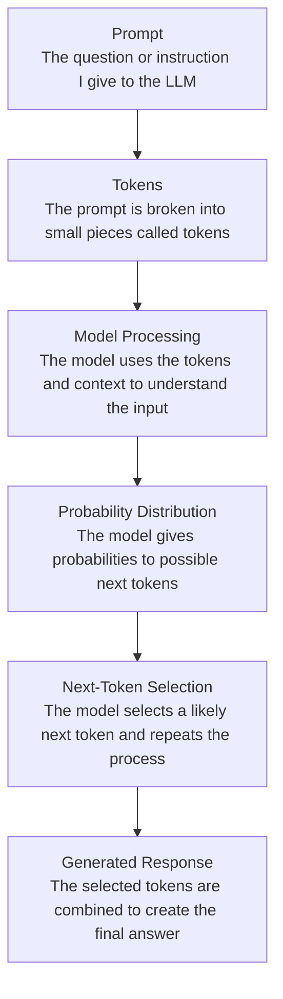
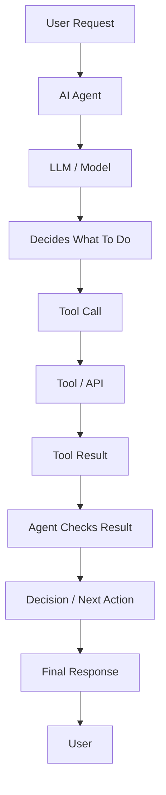

# WEEK-01 CORE ASSESSMENT
# Q1.AI,ML,Deep learning,Generative AI,Agents
## Answers:
# Explaination
-#Artificial Intelligence:
It makes the machines which are capable of making tasks which are actually done by the human intelligence like reasoning, making decisions, understanding the data.
-#Machine Learning:
It is a subset of AI. It makes the  computers able to read the large data given by us by patterning itself and to make predictions.
-#Deep Learning:
It is a part of Machine Learning. It uses  artificial neural networks with multiple layers to learn the data from images and audios.
-#Generative AI:
It can create new content based on patterns it learned from existing data .It can produce text, images, code and videos.
-#AI agent:
It is a system that can understand a goal ,decide what action should be taken and performs the action.
# Conceptual map
                    ARTIFICIAL INTELLIGENCE (AI)
                              │
                              │
                 ┌────────────▼────────────┐
                 │    MACHINE LEARNING     │
                 │  Learns patterns from   │
                 │         data            │
                 └────────────┬────────────┘
                              │
                 ┌────────────▼────────────┐
                 │    DEEP LEARNING        │
                 │ Uses neural networks    │
                 │ with many layers        │
                 └────────────┬────────────┘
                              │
                 ┌────────────▼────────────┐
                 │     GENERATIVE AI       │
                 │ Creates new content     │
                 │ like text, images,      │
                 │ audio, or code          │
                 └─────────────────────────┘

             AI AGENT
                 │
                 ├── Uses an AI model
                 ├── Understands a goal
                 ├── Uses tools
                 ├── Makes decisions
                 └── Takes actions

## Examples
-# Artificial Intelligence: Google maps uses AI to suggest best route based on traffic
-# Machine Learning: Youtube used ML to recommend videos based on our watch history
-# Deep Learning: In face unlock to recognize user face.
-# Generative AI : Chatgpt uses it to create answers from our questions.
-# AI Agent: AI travel agents can search hotels and flights and helps us to plan for a trip.

# Evidence:
I learned about Artificial intelligence, Machine learning, Deep learning ,generative AI, Neural networks using IBM's learning resources and real life examples.
I also learned how they are connected to each other and how they are used for learning from data, recognizing patterns, creating content , perfoming tasks and how they are making decisions.

# Verification:
I verified my understanding by referring to the information provided by IBM .I understood that AI is the broader field , Machine learning is the part of AI, and Deep learning is a type of machine learning that uses neural networks. I learned that Generative AI creates the content and AI agents can perform tasks based on given goal.

# Reflection:
I understood the relationship between different AI concepts more clearly. I learned that AI is the main concept and Machine learning and deep learning help machines learn from data. This learning helped me understand how the concepts are related and different from each other.

# Question 2:Is Everything That Looks Intelligent Actually AI
| Case | Example | Classification | Reason |
|---|---|---|---|
| **A** | A calculator produces 25 × 16 = 400. | **Deterministic/Traditional Software (Not AI)** | It follows fixed mathematical rules and does not learn from data. |
| **B** | If temperature > 80°C, display WARNING. | **Deterministic/Traditional Software (Not AI)** | It follows a fixed if–then rule given by the programmer. |
| **C** | An email system identifies spam based on patterns learned from previous email data. | **Machine-Learning-Based AI** | It learns patterns from previous emails and uses them to identify new spam messages. |
| **D** | An AI assistant writes a summary of a document. | **Generative AI** | It generates new text based on the information in the document. |
| **E** | A navigation application predicts estimated arrival time using traffic and historical data. | **Machine-Learning-Based AI** | It uses current and historical traffic patterns to predict travel time. 

# Explicit Instructions vs AI Systems:
-An explicit-instruction system follows fixed rules written by a programmer and gives predictable outputs for given inputs.
-An AI system can learn patterns from data and use them to make predictions, classifications, or generate content.

# Evidence:
From these examples, I can see that not every automated system is AI. A calculator just follows mathematical instructions, and the temperature program follows a
fixed rule. The spam filter learns from previous emails, while the AI assistant creates a new summary. So, the way the system works helps me identify whether it
is AI or not.
# Verification:
I can verify my answer by checking whether the system follows fixed instructions or learns from data. If it follows a fixed rule, it is traditional software. If
it learns patterns from data, it is machine-learning AI. If it creates new content, it is generative AI. This helps me make the correct classification.
# Reflection:
I learned that just because something looks intelligent, it does not mean it is AI. Some programs only follow instructions given by humans. AI systems can learn
from data and make predictions or create new content. This helped me understand the main difference between normal software and AI.

# Question3: What happens when you ask an LLM a Question?
# Answer
-Prompt: A prompt is the question or instruction that I give to the language model.
-Tokens: A model which breaks the prompt into smaller parts called tokens. A token can be a word, part of a word, or a punctuation mark.
-Model Processing: The model looks at the tokens and the context around them. It uses the patterns it learned during training to understand what kind of answer
could come next.
-Probability Distribution: The model gives different possible next tokens of different probabilities. Some words or tokens will have a higher probability of
coming next than others.
-Next-Token Prediction: The model chooses a likely next token and then predicts the next one. It keeps doing this step by step until it has enough tokens to form
the answer.
-Generated Response: All the selected tokens are put together to make the final response that we can see.
# FLOW DIAGRAM
### LLM Question Flow

# Training and Inference
Training is when the model learns patterns from a large amount of data. Inference is when we give the trained model a prompt and it uses what it learned to
generate an answer.
# Why Can an LLM Give False Information?
An LLM can give false information because it mainly predicts the most likely next words based on patterns it learned from data. It does not always know whether
the information is true or false. Sometimes it may give an answer that sounds confident and correct but is actually wrong or unsupported. Therefore, important
information should always be checked with reliable sources.
# Evidence:
I understood that an LLM can give false information because it predicts words based on patterns learned from its training data. It does not always check whether
the information is actually true. This is why it can give an answer that sounds correct but may contain wrong information.
# Verification:
I verified this by checking technical information about how LLMs generate text. The explanation supports that LLMs use next-token prediction to generate
responses. 
# Reflection:
From this, I learned that I should not assume an answer is correct just because it sounds confident. An LLM is mainly predicting and generating text based on
learned patterns. So, for important information, I should check the answer with reliable sources.

# Question4: Hallucination Experiment: Can AI sound confident and still be wrong?
I asked the same question to two different AI assistants and then checked their answers with a reliable technical source.
| Prompt | Model | Response Summary | Verified Claim | Evidence | Result | Lesson |
|---|---|---|---|---|---|---|
| What is the default port number used by HTTPS? | ChatGPT | It said that HTTPS normally uses port 443. | HTTPS uses port 443 by default. | IANA lists HTTPS on port 443. | Correct | The answer was correct and supported by a reliable source. |
| What is the default port number used by HTTPS? | Gemini | It said that HTTPS normally uses port 443. | HTTPS uses port 443 by default. | IANA lists HTTPS on port 443. | Correct | The answer matched the reliable source. |

# Evidence:
I asked the same question to two different AI assistants about the default port number used by HTTPS. Both AI assistants answered that HTTPS normally uses port 
443. I then compared their answers with information from IANA, which also lists HTTPS on port 443.
# Verification:
I verified the answers using the IANA Service Name and Port Number Registry. The source confirms that HTTPS is registered on port 443. Therefore, both AI answers
were correct and supported by a reliable technical source.
# Reflection:
From this experiment, I learned that checking an AI answer is important even when the answer looks simple and confident. In my test, both answers were correct, so
I did not find a hallucination. Still, I understood that AI answers should be verified with reliable sources when accuracy is important.

# Question5: AI Assistant vs Search vs Authoritative Reference
# What is the difference between RAM and ROM?
| Method | Accuracy | Explanation | Traceability | Ease of Verification |
|---|---|---|---|---|
| AI Assistant | Quick and useful, but it can sometimes give incorrect information. | Gives simple and easy-to-understand explanations. | Depends on whether the AI provides sources. | Easy to verify using other reliable sources. |
| Web Search | Can provide information from many different sources. | Gives both simple and detailed explanations. | Depends on the website and source used. | Easy if reliable sources are selected. |
| Authoritative Reference | Usually the most reliable for technical facts. | May use more technical language. | High because the original source can be identified. | Best for confirming important information. |

# Evidence:
I compared the answers about the difference between RAM and ROM using an AI assistant, web search, and a reliable technical source. The AI explained the topic in
simple words, while the web search gave information from different websites. The technical reference supported the main point that RAM is volatile memory and ROM
is non-volatile memory.
# Verification:
I verified the information by checking reliable technical information about RAM and ROM. RAM normally loses its stored data when the power is turned off, while
ROM can retain information without power. This confirmed that the basic answers given by the AI and web search were correct.
# Reflection:
From this comparison, I learned that AI is useful when I want a quick and simple explanation. Web search is useful when I want to look at information from
different sources. For important technical information, I should check an authoritative source because it gives stronger evidence and helps me make sure the
information is correct.

# Question6 :What is an AI Agent?
# Comparison Table:
| Idea | My Understanding |
|---|---|
| LLM | An LLM is a model that understands and generates human-like text based on patterns learned from a large amount of data. |
| LLM Application | An LLM application is a software system that uses an LLM to perform a specific task, such as answering questions or summarizing documents. |
| RAG System | A RAG system gives the LLM additional information from external documents or databases to improve its answers. |
| Tool-Using Assistant | A tool-using assistant can use external tools such as search, calculators, databases, or APIs to get information or perform tasks. |
| AI Agent | An AI agent can understand a goal, decide the steps needed, use tools, check the results, and continue until the task is completed. |
# What Makes an Agent Different from a Simple Chatbot?
A simple chatbot mainly responds to the user's message by generating text. An AI agent can go beyond generating text by deciding what actions are needed, using
tools, checking the results, and taking additional steps. Therefore, an agent is more focused on completing a task or goal, while a simple chatbot mainly focuses
on conversation.
# Architecture Diagram:
## AI Agent Architecture

# Evidence:
I learned that an LLM mainly generates text from the patterns it learned. An LLM application uses the model to do a specific task. 
# Verification:
I checked my understanding using a reliable source about AI agents. It explains that agents can use tools, make decisions, and take actions to achieve a goal.
This helped me understand the difference between a simple chatbot and an AI agent.
# Reflection:
From this topic, I learned that an AI agent is more than just a chatbot. A chatbot mainly gives answers, while an agent can use tools and take actions. 

# Question 7:Where should Humans still make the decision?
| Situation | Possible Failure | Required Verification | Who/What Approves the Result |
|---|---|---|---|
| AI summarizes an important document | The AI may leave out important information or misunderstand something. | Compare the summary with the original document. | A human should check and approve it. |
| AI gives financial advice | The advice may be based on incorrect or outdated information. | Check the information with trusted financial sources. | A qualified person should make the final decision. |
| AI suggests a medical action | The suggestion may not be suitable for the person's situation. | Check with a qualified healthcare professional. | A healthcare professional should approve the decision. |
| AI writes an important work email | The message may contain wrong information or an inappropriate statement. | Read and check the message before sending it. | The person sending the email should approve it. |
| AI recommends an important business decision | The recommendation may use incomplete or incorrect information. | Check the data, sources, and assumptions used by the AI. | A responsible human decision-maker should approve it. |

# Why Human Verification Is Important
AI can process information quickly and give useful suggestions, but it can also make mistakes or misunderstand information. If the result affects money, health,
important communication, or other serious decisions, a human should check the information before taking action.
# Evidence:
I learned that AI outputs should not always be accepted without checking because AI can produce incorrect or incomplete information. Human review helps identify
mistakes and makes sure that the final decision is based on reliable information.
# Verification
I would verify an AI recommendation by checking the original information, reliable sources, calculations, or other evidence related to the decision. 
# Reflection:
From this topic, I learned that AI should help humans rather than completely replace human judgment. AI can save time and provide useful suggestions, but humans
should check important outputs before acting on them. 

# Question 8: Find AI Around you
| System / Feature | AI Involvement | Task Type | Evidence / Source | My Conclusion |
|---|---|---|---|---|
| Google Maps | Yes, ML is involved | Prediction | Google explains that Maps uses machine learning with traffic and historical data to predict travel times. | AI/ML is involved. |
| Gmail Spam Filter | Yes, ML is involved | Classification | Google explains that Gmail uses machine learning to detect spam and phishing emails. | AI/ML is involved. |
| YouTube Recommendations | Yes, ML is involved | Recommendation | YouTube explains that its recommendation system uses machine-learning models to recommend content. | AI/ML is involved. |
| Google Photos AI Editing | Yes, AI is involved | Generation / Editing | Google explains that Google Photos uses AI capabilities for editing images. | AI is involved. |
| Calculator App | No AI is required | Calculation | A calculator can perform calculations using fixed mathematical rules without machine learning. | Traditional software is enough. |

# Evidence:
I found that AI is used in apps like Google Maps, Gmail, YouTube, and Google Photos. These apps use AI or machine learning for prediction, spam detection,
recommendations, and image editing. 
# Verification:
I checked the official sources of these applications to confirm their use of AI. The sources showed that AI or machine learning is used in the features I
selected. This helped me confirm my answers.
# Reflection:
I learned that many apps I use every day have AI features. I also learned that every smart-looking feature is not necessarily AI. I should check reliable sources
before deciding whether a system uses AI.

# Question 9: Prediction, Classification and Generation
# Classification table:
| Example | Type | Reason |
|---|---|---|
| A. Predicting house prices | Prediction | The system predicts a future or unknown price using available data. |
| B. Detecting whether an image contains a cat | Classification | The system decides whether the image belongs to the category "contains a cat" or "does not contain a cat". |
| C. Writing an email from a short instruction | Generation | The system creates new text based on the given instruction. |
| D. Predicting whether a customer will cancel a subscription | Prediction | The system predicts whether a future event, such as cancellation, is likely to happen. |
| E. Summarizing a research paper | Generation | The system generates a shorter version of the information in the paper. |
| F. Identifying whether a transaction is fraudulent | Classification | The system classifies the transaction as fraudulent or not fraudulent. |
| G. Generating an image from a text description | Generation | The system creates a new image based on the given text description. |
| H. Predicting the next word/token in a sentence | Prediction | The model predicts which token is most likely to come next based on the previous context. |
# Why Is Next-Token Prediction Important?
Next-token prediction is important because language models generate text one token at a time. The model looks at the previous tokens and predicts what should come
next. By repeating this process, it can produce complete answers, summaries, emails, and even code. So, many different language tasks are built on the same basic
idea of predicting the next token.
# Evidence:
I learned that prediction, classification, and generation are different types of AI tasks. Prediction estimates an unknown or future result, classification puts
something into a category, and generation creates new content. Language models use next-token prediction to generate text step by step.
# Verification:
I checked the different examples and compared them with the basic meanings of prediction, classification, and generation. The examples matched their main task
type. I also checked that language models use next-token prediction to generate text step by step.
# Reflection:
From this activity, I learned that AI tasks can be divided into prediction, classification, and generation. I understood that next-token prediction is important
for generating text. This helped me understand how one basic process can be used for writing, summarizing, coding, and answering questions.

# Question 10: Design your personal verification protocol.
# My Personal Verification Protocol
-1. Define the Problem
First, I will clearly understand what problem I am trying to solve and what output I need. This helps avoid solving the wrong problem.
-2. Check the AI Output
I will read the complete AI answer carefully and understand what it is saying. This helps me notice obvious mistakes or missing information.
-3. Inspect the Assumptions
I will check what assumptions the AI has made while giving the answer. This helps me find cases where the answer may depend on incorrect or missing information.
-4. Check the Evidence and Sources
I will check the sources, data, or evidence used to support the answer. This helps me avoid trusting unsupported or unreliable information.
-5. Test the Result
I will test the answer using examples, calculations, experiments, or another reliable method. This helps me find errors that may not be obvious by just reading the answer.
-6. Compare and Review
I will compare the result with trusted information or another method and review whether it makes sense. This helps me catch differences, incomplete answers, or unexpected results.
-7. Accept, Reject, or Revise
Finally, I will decide whether to accept, reject, or revise the AI output. I will accept it only when I am satisfied that the result is correct and properly verified.
# Simple Example
Suppose I ask an AI assistant to calculate the total cost of buying 5 books at ₹200 each.
Step 1: I define the problem: find the total cost.
Step 2: I check the AI's answer.
Step 3: I check the assumption that each book costs ₹200.
Step 4: I check the given price from the actual information.
Step 5: I calculate it myself: 5 × ₹200 = ₹1,000.
Step 6: I compare my calculation with the AI's result.
Step 7: If both match, I accept the answer; otherwise, I revise or reject it.
# Evidence:
I learned that AI can give useful answers, but the result may not always be correct. Checking the problem, assumptions, sources, and final result can help me find
possible mistakes. Testing the answer with another method gives me more confidence in the result.
# Verification:
I verified my answer by following the main steps of AI verification: understand the problem, check assumptions, check reliable sources, and test the result. These
steps help me decide whether the AI answer is correct or needs to be changed.
# Reflection:
From this activity, I learned that I should not accept an AI answer without checking it. I should use AI as a helper and make the final decision after
verification. I can also improve this verification process as I learn more about AI during the program.

